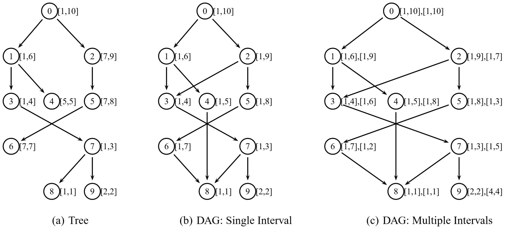

# Reachability Queries in Directed Graphs 
Project for the "System and Device Programming" course @ Politecnico di Torino a.y. 2019/2020

## Running the Code  
To run the code execute the Makefile with `make`. Then execute  `./runner`. This will prompt the user to choose among **four** modes: 
1) Sequential version; 
2) Parallel version v1; 
3) Parallel version v2; 
4) All of the previous together in sequence. 

The code of the first three modes can be found in `main.c`, `main2.c` and `main3.c` respectively.

## Project’s summary 
Given a graph, finding the mutual reachability of two vertices is an important task. To be efficient, many methods use labeling approaches, i.e., they add extra-information to each vertex to help solving subsequent reachability queries. This project requires a parallel implementation of a very fast and efficient algorithm, presented a few years ago by a group of researchers, and called GRAIL.  

## Problem Definition 
Let G = (V, E) be a directed graph where V represents the set of vertices and E the set of directed  edges. Given two vertices u∈V and v∈V, we say that v is reachable from u (i.e., u→v) if and only if there exist a path from u to v. When this condition is not true, we write u!→v.  
 
Reachability queries in graphs arise in several application domains, ranging from software management, geographical navigation, Internet routing, XML indexing, and ontology queries. For example, on a social network it may be useful to know whether a member v has direct or undirect contacts with another member u.  
 
Standard approaches to solve reachability queries rely either on breadth-first (BFS) or depth-first (DFS) searches, or on the computation of the Transitive Closure of the graph. Unfortunately, BFS and DFS searches have linear time complexity (in the graph size) for each query. At the same time, computing the transitive closure of a graph implies storing the list of all reachable nodes for every vertex, and this strategy has a quadratic memory occupation (in the graph size). As a consequence, both of these direct approaches do not scale well for very large graphs, and most practical reachability algorithms lie somewhere in between them. 
 
Interval labeling techniques consist in 
- Assigning to each node one or more labels, where each label represents an interval.  
- Use label containment to verify vertex reachability.  

For example, for the **Directed Tree** (DT) of the next figure (left-hand side) the labeling can be constructed through a simple DFS, with a construction time which is linear in the number of vertices. Then, the labels can be used to verify reachability. For example, we may argue that 
- L is not reachable from E, since [2,2] ⊄  [5,5]  
- L is reachable from D, since interval [2,2] ⊆ [1,4].  

For **Directed Acyclic Graphs** (DAGs), that are a generalization of DTs, min-post labeling allows us to capture all reachable pairs, while falsely marking as reachable pairs that do not reach each other. This effect can be seen in the DAG in the middle of the next figure. In fact, [1,5] ⊆ [1,8], and this would result in concluding that F→E, which is not true.  
To avoid exceptions as long as possible, the GRAIL approach (please, see reference) randomizes multiple interval labeling, i.e., instead of generating a unique label, it performs many traversals following random orders, creating multiple intervals for every vertex. The result of this process is represented in the DAG on the left-hand side of the next picture, using two label pairs. For example, in this case for node F and E, [1,5] ⊆ [1,8] (first label pair) but [1,8] ⊄ [1,3] (second label pair), and this would result in concluding that F !→ E.  

Usually, a small number of labels is sufficient to drastically reduce the number of exceptions. More labels will minimize the impact of exceptions on performance, and it will not have a significant impact on index creation time or size. All remaining false positives will be dealt with by creating exception lists, which may be expensive, or by resorting to extra DFS queries, that are anyhow much faster than the original DFSs as they use interval comparison to prune the tree at every level. 
 
Further details on the overall method are given in the referenced paper. 

## Target of the Project 
The target of this work is to write a concurrent application able to: 
- Receive three parameters on the command line `file1  n  file2` 
- Read a DAG from file `file1` (with a specific and given format). 
- Generate a labeling with `n` label pairs for each graph vertex (generation phase). 
- Solve all reachability queries stored in the file `file2` using this labeling (query phase) and state the reachability or non-reachability for each vertex pair.  

Both the generation and the query phase will have to be evaluated in terms of CPU time and memory usage. 

## References 
H. Yildirim, V. Chaoji and M. J. Zaki, “GRAIL: Scalable Reachability Index for Large Graphs”, Proc. VLDB Endow., September 2010, vol. 3, no. 1-2, pp. 276--284,  Sept. 2010, ISSN 21508097,  http://dx.doi.org/10.14778/1920841.1920879, DOI: 10.14778/1920841.1920879 
